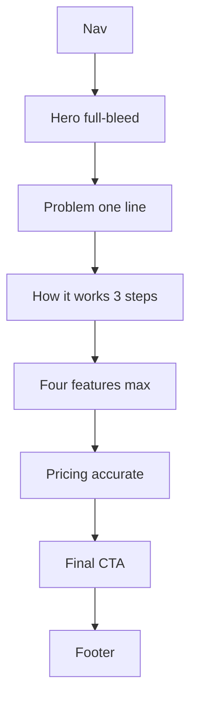

# Homepage Premium Redesign

## What’s wrong today

[`Homepage.jsx`](src/components/Homepage.jsx) tries to do too much: hero with **3 rotating tabs**, a **vanity stats row** (`2.4k` / `94%`), a long feature list (Notes appears twice), a separate integrations block, then dense pricing.

Pricing claims are also out of sync with the product:

| Claim on homepage | Reality in [`PLAN_LIMITS`](src/lib/utils.js) / [`Paywalls.jsx`](src/components/Paywalls.jsx) |
|---|---|
| Starter: CSV import | Starter `bulkImport: false` |
| Pro: AI Commands / MCP as included | Marked **Coming Soon** on upgrade page |
| Missing on cards | Invoices, 7-checkpoint reminders, Sheets, Calendar (Pro+), Hot/Warm/Cold |
| Starter lead counts | Yearly “2,000” is marketing copy; enforce what’s true in limits + billing |

**Default for this plan:** keep **Teams as Coming Soon** (matches Paywalls). Treat **`PLAN_LIMITS` + `BILLING` prices** as truth; rebuild feature bullets from that. Sync homepage and upgrade page from one shared list so they cannot drift again.

---

## New page structure (sparse)

Follow your design rules: one job per section, brand-first hero, no stuffed first viewport.

**Remove:** vanity stats row, hero feature tabs (they fight the headline), duplicate Notes row, heavy integrations card grid (fold Calendar/Sheets into Pro feature bullets + one quiet line under features).

**Hero (first viewport only):**
- Brand wordmark (REACHDESK)
- One headline
- One short supporting sentence
- One CTA group (`Start free trial` + `See pricing`)
- Full-bleed / edge-dominant product screenshot (keep existing assets; enlarge and simplify chrome around them)

---

## Copy direction (conversion)

Speak to the pain: leads go quiet, follow-ups slip, deals die in DMs/notes apps.

| Block | Copy (draft to implement) |
|---|---|
| Hero H1 | `Your leads didn’t ghost you. You ghosted them.` |
| Hero sub | `ReachDesk tells you who to follow up with today — so nothing slips while you’re busy delivering client work.` |
| CTA | `Start free — 65 leads, no card` |
| Problem line | `Spreadsheets. Notes apps. Memory. That’s how freelancers lose booked calls.` |
| How it works | 1. Add the lead · 2. Mark Contacted · 3. Get reminded until they reply or you close |
| Features (4) | Pipeline & priorities · 7-checkpoint follow-ups · Templates you reuse · Invoices & revenue |
| Pricing H2 | `Simple plans. Real limits. No fake AI promises.` |
| Final CTA | `Stop losing deals to forgotten follow-ups.` |

Update [`siteMeta.pages.homepage`](src/config/metadata.js) description/title to match the new headline for SEO.

---

## Accurate pricing features (shared source)

Add a small shared module, e.g. [`src/lib/planMarketing.js`](src/lib/planMarketing.js), exporting feature bullets derived from `PLAN_LIMITS` + honest extras:

**Starter**
- 1,000 leads (note yearly bump only if billing truly grants it — else drop the “2,000 yearly” claim everywhere)
- 10 templates
- Smart folders, notes, Sheets import/export, convert to client, custom columns
- No: bulk CSV import, Calendar (call out on Pro)

**Pro**
- 5,000 leads
- Unlimited templates
- Everything in Starter + bulk CSV import + Google Calendar sync + invoices/revenue (if available to Pro in-app)
- Do **not** list AI Commands / MCP as included; omit or label Coming Soon only if you keep a “Soon” line

**Teams (Coming Soon)**
- Unlimited leads · 3 seats · shared pipeline
- Keep disabled card

Wire [`Homepage.jsx`](src/components/Homepage.jsx) pricing cards **and** [`Paywalls.jsx`](src/components/Paywalls.jsx) `PLANS` / `CORE_FEATURES` to this module so upgrade UI stays honest too.

---

## Premium motion (CSS-first, no new animation library)

In [`src/index.css`](src/index.css) `.hp-*`:

1. **Hero entrance** — fade/slide brand + headline + CTA (stagger ~80–120ms); mockup slight scale/opacity
2. **Scroll reveal** — sections fade-up via `IntersectionObserver` class `.hp-reveal` (or CSS `@starting-style` / scroll-timeline where safe)
3. **Pricing / feature hover** — soft border/color only; no bounce, no glow spam
4. Respect **`prefers-reduced-motion: reduce`** — disable transforms/animations

Keep existing flowing gradient quiet or remove if it feels busy; premium = controlled motion, not constant background churn.

---

## Implementation steps

1. Create `planMarketing.js` with accurate bullets; update Paywalls `PLANS` to import it.
2. Rewrite `Homepage.jsx` section structure + copy; drop stats, tabs, duplicate features; slim integrations.
3. Restyle `.hp-*` in `index.css`: more whitespace (`--space-7`/`--space-8`), larger type hierarchy, quieter pricing cards, reveal + hero animations + reduced-motion.
4. Update SEO metadata strings.
5. Manual check dark + light, mobile hero, pricing toggle PK/BD/USD, CTA → signup.

**Out of scope:** rebuilding product screenshots, rewriting the blog, changing actual Paddle prices or `PLAN_LIMITS` numbers (only marketing claims unless you later decide limits themselves are wrong).
