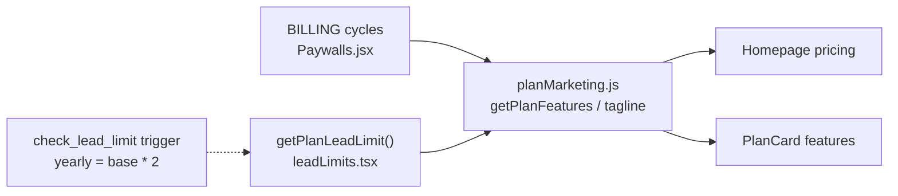

# Pricing & Upgrade UI Refresh

## Problems to fix

1. **Broken feature copy** — Homepage feature rows use Mattone (`10.5px`) via [`.hp-plan-feature-item`](src/index.css). Mattone does not render `&`, so strings like `"Notes & whiteboard"` appear as `"Notes whiteboard"` (same for Smart folders, Custom columns, Invoices). Paywalls already uses `Check` icons + readable body font; homepage still uses `+` prefixes.

2. **Static lead counts** — [planMarketing.js](src/lib/planMarketing.js) hardcodes `"1,000 leads"` / `"5,000 leads"` in taglines and feature arrays. `tagline(billing)` is called but ignores `billing`. Yearly 2× is **already enforced** in DB ([migration trigger](supabase/migrations/20260721000001_enforce_plan_limits.sql)) and in app UI via [`getPlanLeadLimit()`](src/lib/leadLimits.tsx)—marketing just doesn’t reflect it yet.

3. **Incomplete billing toggle on homepage** — Only Monthly/Yearly in [Homepage.jsx](src/components/Homepage.jsx). [Paywalls.jsx](src/components/Paywalls.jsx) already exposes all four cycles via `BILLING`: `monthly`, `quarterly`, `sixMonth`, `yearly`.

4. **Visual mismatch** — Upgrade page (inline styles, Check icons) vs homepage (hp-* CSS, `+` icons) feel like two different products. User wants bolder, Sendr-like hierarchy: large prices, clear feature blocks, pill toggles, bonus badges, more breathing room.



---

## 1. Billing-aware plan copy — [planMarketing.js](src/lib/planMarketing.js)

Extend the shared marketing module (reuse existing logic, don’t duplicate):

- Import `getPlanLeadLimit` from [`src/lib/leadLimits.tsx`](src/lib/leadLimits.tsx).
- Add helpers:
  - `formatLeadCountForBilling(planId, billingCycle)` → uses `getPlanLeadLimit`, returns `"2,000 leads"` or `"Unlimited leads"`.
  - `getPlanTagline(planId, billingCycle)` → `"2,000 leads · 1 user · 10 templates"` (dynamic first segment).
  - `getPlanFeatures(planId, billingCycle)` → base feature lists **without** a static lead line; prepend dynamic lead count as first item; optionally append a yearly-only bonus object for Starter/Pro:
    ```js
    { label: '2× lead capacity on yearly', badge: 'Bonus' }  // only when billing === 'yearly'
    ```
- Change `MARKETING_PLANS` entries to use `tagline: (billing) => getPlanTagline(id, billing)` and `getFeatures: (billing) => getPlanFeatures(id, billing)` (or compute features at render time).
- Replace `&` in static strings with `" · "` or `" and "` for readability even if font changes later (e.g. `"Smart folders · Hot/Warm/Cold priorities"`).

**Lead limit rules (match DB + user spec):**

| Plan | monthly / quarterly / sixMonth | yearly |
|------|-------------------------------|--------|
| Starter | 1,000 | 2,000 |
| Pro | 5,000 | 10,000 |
| Teams | Unlimited | Unlimited |

---

## 2. Homepage pricing — [Homepage.jsx](src/components/Homepage.jsx)

- **Billing toggle**: Replace 2-button toggle with a loop over `Object.entries(BILLING)` (same pattern as Paywalls ~689–724), including per-cycle badges (`Save up to 20%`, etc.). Add horizontal scroll/wrap on mobile via CSS.
- **Yearly callout**: When `billing === 'yearly'`, show a short line under the toggle: *"Yearly plans include 2× lead capacity."*
- **Dynamic copy**: Render `plan.getFeatures(billing)` (or helper) instead of static `plan.features`; tagline already passes `billing` once helpers exist.
- **Feature list**: Import `Check` from lucide-react; replace `+` prefix with check icon (match Paywalls). Support optional `{ label, badge }` feature objects for the yearly bonus row.
- **Keys**: Use stable keys (`feat.label ?? feat`) since lead count string changes per billing cycle.

---

## 3. Upgrade page sync — [Paywalls.jsx](src/components/Paywalls.jsx)

- In `PlanCard`, resolve features via `getPlanFeatures(id, billing)` instead of static `plan.features`.
- Add the same yearly 2× callout above the plan grid when yearly is selected.
- **Visual alignment** (Sendr-inspired, shared with homepage):
  - Migrate PlanCard layout from heavy inline styles to shared CSS classes (new block below).
  - Match homepage: larger plan name + price, consistent feature row spacing, pill-style billing toggle (reuse `.hp-billing-toggle` / `.hp-billing-btn` or rename to neutral `.rd-pricing-*` used by both).
  - Keep Paywalls-specific badges (Current Plan, discount savings) — position them so they don’t collide with homepage-style “Most Popular” ribbon on Starter.

No Paddle/price ID changes needed — [BILLING](src/components/Paywalls.jsx) already has all cycles.

---

## 4. CSS refresh — [index.css](src/index.css)

Sendr-inspired adjustments (bold hierarchy, eye flow) scoped to pricing:

| Element | Change |
|---------|--------|
| Section | Stronger eyebrow + H2 (already partially there); add subtle background gradient or top border accent on pricing section |
| Billing toggle | 4-tab pill; active state with stronger fill; badge chips for savings |
| Cards | More padding (`2.5rem`), larger price (`clamp(1.75rem, 4vw, 2.25rem)`), clearer separation between price block and features |
| Features | **Plus Jakarta Sans**, `13–14px`, `gap: 0.65rem`, `align-items: flex-start`, check icon top-aligned; remove Mattone from feature rows |
| Popular plan | Slightly elevated card (transform/border/shadow), keep blue accent |
| Yearly bonus | Small pill badge on bonus feature row (reuse Paywalls badge pattern) |
| Mobile | `@media (max-width: 640px)`: billing toggle `overflow-x: auto`, single-column cards |

Rename or alias classes to `.rd-pricing-*` if both Homepage and Paywalls will share them (e.g. `.rd-pricing-card`, `.rd-pricing-feature`, `.rd-billing-toggle`).

---

## 5. Verification

- Toggle all 4 billing cycles on homepage + upgrade page: Starter tagline/features show 1,000 vs 2,000 leads; Pro 5,000 vs 10,000.
- Confirm `&`/separator text reads correctly in feature lists (Smart folders · Hot/Warm/Cold, etc.).
- Dark + light theme, PK/BD/USD price formatting unchanged.
- Mobile: 4-tab billing scrolls cleanly; cards stack.
- No backend changes required — enforcement already matches marketing rules.

---

## Files touched

| File | Role |
|------|------|
| [src/lib/planMarketing.js](src/lib/planMarketing.js) | Billing-aware taglines, features, yearly bonus |
| [src/components/Homepage.jsx](src/components/Homepage.jsx) | 4-cycle toggle, Check icons, dynamic features |
| [src/components/Paywalls.jsx](src/components/Paywalls.jsx) | Dynamic features, shared pricing CSS, yearly callout |
| [src/index.css](src/index.css) | Shared bold pricing styles, feature typography fix |

**Out of scope:** Paddle/webhook changes, new plan tiers, or refactoring `leadLimits.tsx` / `utils.js` duplication (can be a follow-up).
