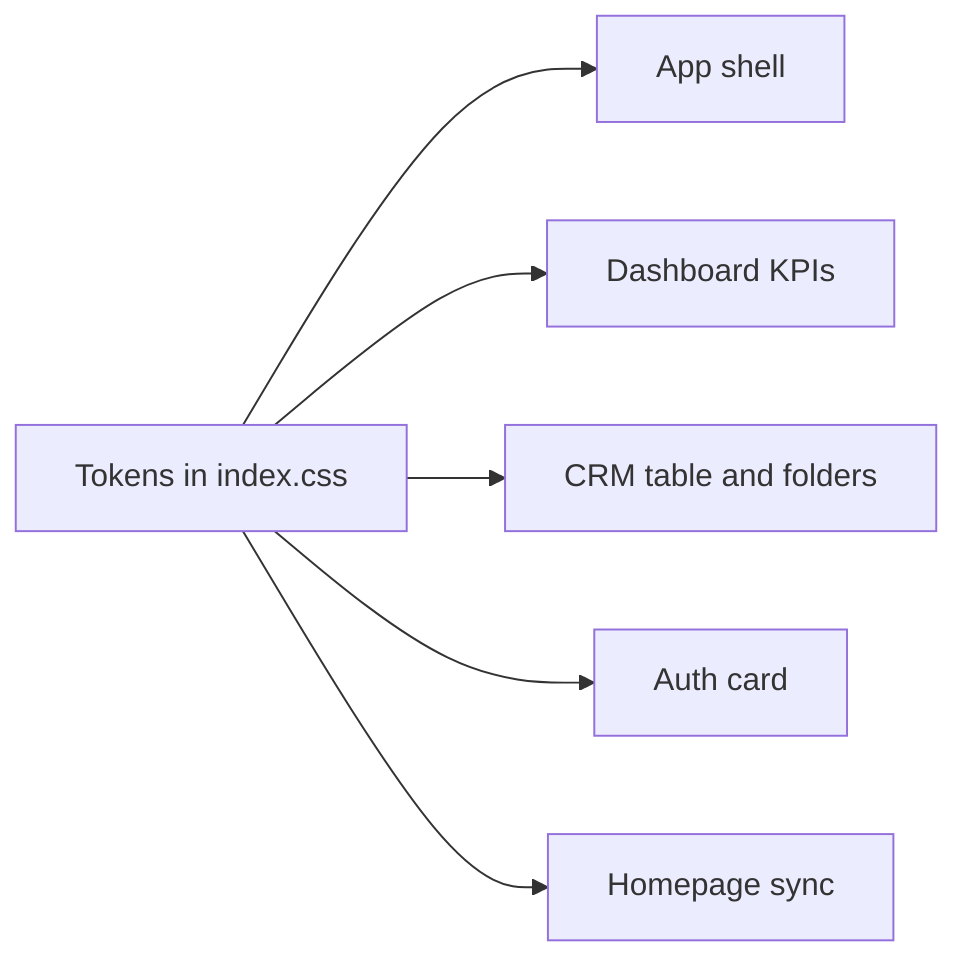

# Security + UI Polish Plan

## Design direction (UI)

Your instinct is right: the brand colors are fine; **spacing and type are inconsistent**, which is what makes it feel unfinished in both modes.

**Keep:** Mattone for logo/display titles, Plus Jakarta Sans for app UI, blue/sage accents, GitHub-dark / soft-gray light palettes.

**Change:**
- Introduce a **4px spacing scale** and a **fixed type ladder** in [`src/index.css`](src/index.css)
- Drop body `line-height: 1.7` → **1.5** for app chrome (keep looser leading only on marketing/legal)
- Stop forcing **Mattone on selects** (`!important` block ~L2830) — Mattone only for brand + page titles
- Light mode: **1px borders** + subtle `--shadow-sm` on cards; dark stays flat
- Kill leftover purple/indigo in auth/legacy pricing so both themes match Craftify blue/sage
- Unify homepage `hp-theme` tokens with app `:root` / `:root.light` (same muted/border values)



---

## Phase 1 — Security (ship first)

### 1. Auth-gate edge functions
Reuse the JWT pattern from [`supabase/functions/groq-chat/index.ts`](supabase/functions/groq-chat/index.ts):

- [`cancel-subscription/index.ts`](supabase/functions/cancel-subscription/index.ts): require `getUser()`, cancel only the caller’s `paddle_subscription_id` (ignore untrusted body id)
- [`send-push-notification/index.ts`](supabase/functions/send-push-notification/index.ts): dual auth — service-role bearer for cron (`send-reminder-notifications`), else JWT; `target_user_id` must equal `user.id`; `notify_admin` allowed for authenticated users; admin query uses `role = 'admin'` only
- [`send-upgrade-email/index.ts`](supabase/functions/send-upgrade-email/index.ts): JWT required; email admins via `role = 'admin'` or `ADMIN_NOTIFY_EMAIL` secret

Client `functions.invoke` already sends the session JWT — call sites in [`Configuration.jsx`](src/components/Configuration.jsx), [`App.jsx`](src/App.jsx), [`UserNotificationBell.jsx`](src/components/UserNotificationBell.jsx) need little or no change.

### 2. Paddle + checkout
In [`Paywalls.jsx`](src/components/Paywalls.jsx):
- `token: import.meta.env.VITE_PADDLE_CLIENT_TOKEN` (already in [`.env.example`](.env.example))
- `successUrl: getAppUrl('/dashboard?upgraded=true')` → app domain, not marketing

### 3. Admin email bypass → role only
Replace `email === 'dotthedart@gmail.com'` with `role === 'admin'` in: `AdminRoute.jsx`, `AppLayout.jsx`, `App.jsx`, `AdminPanel.jsx`, `Reminders.jsx`, `UserNotificationBell.jsx`, `Configuration.jsx`, and matching edge functions.

**Prerequisite before deploy:** confirm that account has `role = 'admin'` in `user_profiles`.

### 4. Stale domain sweep
`reachdesk.esemdot.com` → `reachdeskcrm.com` / `app.reachdeskcrm.com` in [`public/sw.js`](public/sw.js), [`BlogIndex.jsx`](src/components/BlogIndex.jsx), [`paddle-webhook`](supabase/functions/paddle-webhook/index.ts), support strings in Paywalls/Legal as needed.

---

## Phase 2 — Design tokens (foundation)

In [`src/index.css`](src/index.css) `:root` (and light overrides where needed), add:

```css
/* Spacing */
--space-1: 4px; --space-2: 8px; --space-3: 12px;
--space-4: 16px; --space-5: 24px; --space-6: 32px;
--space-7: 40px; --space-8: 48px;

/* Type */
--text-3xs: 0.625rem; --text-2xs: 0.6875rem; --text-xs: 0.75rem;
--text-sm: 0.875rem;  /* default UI */
--text-md: 1rem; --text-lg: 1.25rem; --text-xl: 1.5rem; --text-2xl: 1.75rem;
--leading-tight: 1.25; --leading-body: 1.5; --tracking-label: 0.08em;

/* Radius */
--radius-sm: 4px; --radius-md: 6px; --radius-lg: 8px;

/* Missing surfaces */
--bg-hover: …; --bg-selected: …; --accent-on: …;
--shadow-sm: …; /* light mode only on cards */
```

Wire base classes to tokens: `.main-content`, `.btn*`, `.card`, `.data-table`, `.sidebar*`, headings, body leading.

---

## Phase 3 — High-impact UI surfaces

Apply tokens (replace scattered rem/px/inline styles) in this order:

| Priority | Surface | Files | What “clean” means |
|---|---|---|---|
| 1 | App shell | [`AppLayout.jsx`](src/components/AppLayout.jsx) + sidebar/mobile CSS | Consistent nav padding, logo via class not inline, mobile inactive color = `var(--text-muted)`, fix 260/240 width conflict |
| 2 | Dashboard | [`Dashboard.jsx`](src/components/Dashboard.jsx) | KPI cards on shared padding/type; stop `fontWeight: 700/800` on Mattone (Regular only); shared empty-state class |
| 3 | CRM | [`CRM.jsx`](src/components/CRM.jsx) folders + table + empty | Table density via `.data-table`; folder sidebar classes instead of inline; same empty state as Dashboard |
| 4 | Auth | [`Auth.jsx`](src/components/Auth.jsx) + `.auth-card` | Dark card = `var(--bg-card)` not purple glass; form gaps `--space-3`; body font on inputs |
| 5 | Homepage sync | `.hp-*` in index.css + [`Homepage.jsx`](src/components/Homepage.jsx) | Snap sizes to type tokens; light hover uses dark tint; align muted/border with `:root.light` |

Also extract one reusable **`.empty-state`** (Dashboard and CRM currently duplicate markup).

**Out of scope for this pass:** rewriting CRM into smaller files, Excalidraw/tldraw, invoice print CSS, full a11y focus-trap pass (can follow later).

---

## Phase 4 — Verify both themes

Manual checklist after UI changes:
- Toggle dark ↔ light on shell, Dashboard, CRM, Auth, Homepage
- Sidebar + mobile nav contrast
- Cards/borders readable in light (no washed 0.5px hairlines)
- Selects/inputs use Jakarta, not Mattone
- No new purple leftovers in touched chrome

Security verify:
- Unauthenticated invoke of cancel/push/upgrade returns 401
- Logged-in user can cancel only own sub
- Reminder cron push still works via service role
- Admin panel only with `role = 'admin'`
- Checkout uses env token + app success URL

---

## Suggested UI look (concrete)

| Element | Spec |
|---|---|
| Default UI text | 14px Jakarta, leading 1.5 |
| Labels / table headers | 12px Jakarta 600, muted, optional `0.08em` tracking |
| Page titles | Mattone 20–24px, weight 400 |
| Card padding | 24px (`--space-5`) |
| Page padding | 32px desktop / 16px mobile |
| Table cell pad | 8px 16px |
| Button pad | 8px 16px, radius 4px |
| Light cards | white + 1px border + soft shadow |
| Dark cards | `#161B22` + 1px `#21262D`, no shadow |

This is the main lever for “premium”: **one rhythm, two type roles, both themes sharing the same scale**.
