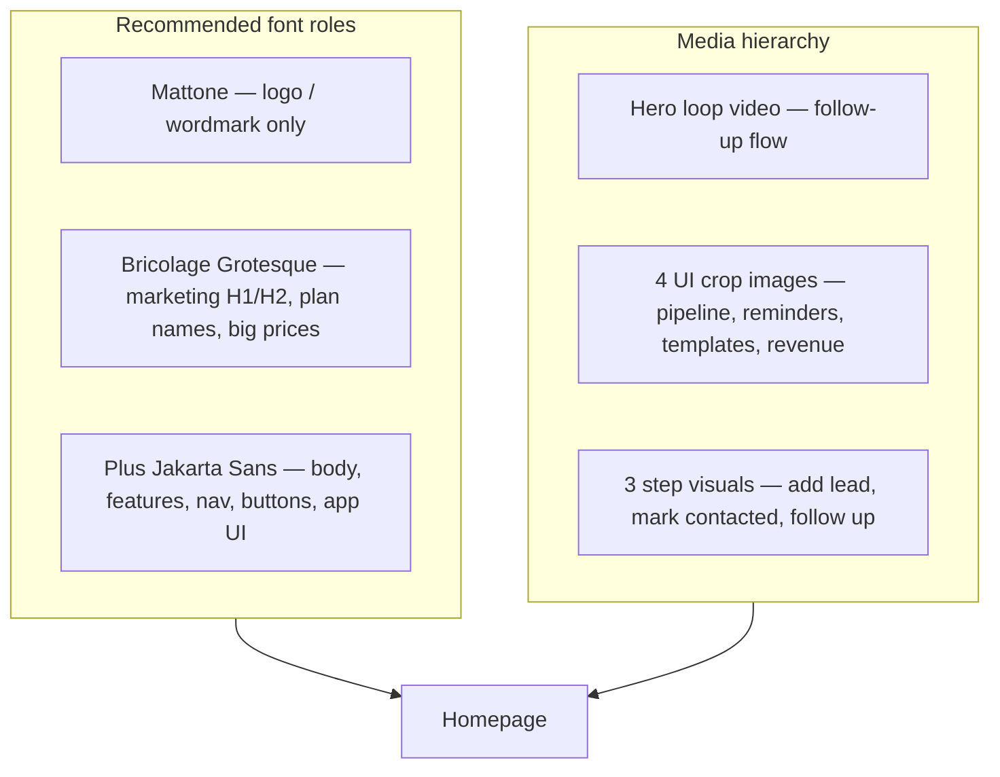

# Visual Brand & Media Guide for ReachDesk

## Why it still feels off

The pricing refresh fixed copy and layout, but the broader brand system is inconsistent:

| Issue | What’s happening today |
|-------|------------------------|
| **Display font overused** | [Mattone](src/index.css) is applied to nav links, section labels, feature titles, prices, CTAs, paywall body, and even 8–11px badges. Mattone is a **display** face — at small sizes it looks cramped, and it **drops glyphs** like `&` (already hit feature lists). |
| **Two systems fighting** | CSS tokens say `--font-body: Plus Jakarta Sans` but dozens of `.hp-*` rules hardcode Mattone for non-headline text. |
| **Unused font loaded** | [index.html](index.html) loads **Bricolage Grotesque** but it’s barely used (only [NoteEditor.jsx](src/components/NoteEditor.jsx)). Sendr-style bold marketing headlines usually need a grotesk like this, not tiny Mattone. |
| **One static hero** | [Homepage.jsx](src/components/Homepage.jsx) uses a single PNG mockup (`hero.png` / `hero_light.png`). No motion, no “aha moment” clip, no cropped UI detail shots in feature cards. |
| **Flat visual rhythm** | Long text blocks + similar card weights everywhere. Sendr works because **type scale + motion + product UI crops** create eye movement; ReachDesk is still mostly text-on-dark. |

---

## Recommended font stack (what *should* be there)

### 1. **Mattone** — brand mark only
- **Use for:** `REACHDESK` logo, loading wordmark, maybe footer logotype.
- **Do not use for:** nav, feature lists, pricing subtext, paywall paragraphs, badges under 14px.
- **Why keep it:** Distinctive identity; works at uppercase + wide tracking.

### 2. **Bricolage Grotesque** — marketing headlines (recommended over Mattone for H1/H2)
- **Use for:** Hero H1, section H2 (`Simple plans. Real limits.`), plan card names, large price numbers on homepage/pricing.
- **Weights:** 600–700 for headlines, 500 for subheads.
- **Sizes:** H1 `clamp(2.5rem, 5vw, 3.5rem)`, H2 `clamp(1.75rem, 3vw, 2.5rem)`.
- **Why:** Already loaded in [index.html](index.html); geometric/bold like Sendr; full punctuation support; reads well at display sizes.

### 3. **Plus Jakarta Sans** — everything else
- **Use for:** Nav links, body copy, feature descriptions, pricing feature rows (already `.rd-pricing-feature`), billing toggle labels, buttons, upgrade page copy, **entire app UI** (CRM, dashboard, auth).
- **Weights:** 400 body, 500 UI labels, 600 buttons/emphasis.
- **Size:** 14–16px body, 12–13px meta.

### 4. **Inter** — optional fallback only
- Keep as fallback in `--font-body`; don’t actively style with it unless Jakarta fails to load.

### Typography rules (enforce in CSS)
- **Never** set Mattone below 18px except logo wordmark.
- **One heading font** on marketing pages: Bricolage (not Mattone + Bricolage mixed).
- **Line-height:** headlines 1.1–1.2, body 1.5–1.6.
- **Letter-spacing:** uppercase labels `0.06–0.08em` in Jakarta, not Mattone.

**Implementation touchpoints:** [src/index.css](src/index.css) (`--font-heading`, `.hp-*`, `.rd-pricing-*`), [Homepage.jsx](src/components/Homepage.jsx), [Paywalls.jsx](src/components/Paywalls.jsx) (remove `fontFamily: 'Mattone'` on overlay/body).

---

## Images & videos — what to create, where to put them

### Priority 1: Hero (highest impact)

**What:** 15–25 second **silent loop** showing the core promise: *mark lead “Contacted” → reminder appears → user follows up*.

**Format:** MP4 (H.264) + WebM fallback; 1920×1080 or 1440×900; under 3MB if possible.

**Placement:** Replace or sit above the static hero PNG in [Homepage.jsx](src/components/Homepage.jsx) `.hp-hero-visual` — autoplay, muted, loop, `playsInline`.

**How to get it (best → acceptable):**
1. **Record your own app** (best) — [Screen Studio](https://screen.studio) (Mac), [OBS](https://obsproject.com/) (free), or Windows Xbox Game Bar. Use a clean demo account with 3–5 sample leads.
2. **Device mockup wrapper** — export your recording through [Rotato](https://rotato.app) or Figma mockup frame so it feels premium.
3. **Avoid:** Generic stock “business person at laptop” — hurts trust for a CRM.

---

### Priority 2: Feature section UI crops (4 images)

Replace icon-only feature cards with **tight product screenshots** (Sendr shows real UI, not abstract icons).

| Feature | Image content | Suggested filename |
|---------|---------------|-------------------|
| Pipeline & priorities | CRM table with Hot/Warm/Cold + status column | `feature-pipeline.webp` |
| 7-checkpoint follow-ups | Reminders panel or notification after “Contacted” | `feature-reminders.webp` |
| Templates | Template editor with placeholders | `feature-templates.webp` |
| Invoices & revenue | Invoice draft or revenue summary | `feature-revenue.webp` |

**Specs:** 1200×800 WebP, dark + light variants (or one image that works on both with border).

**Placement:** [Homepage.jsx](src/components/Homepage.jsx) `#features` grid — image top, title + one line below.

**How to get:** Screenshot ReachDesk at 2× resolution → crop in Figma/CleanShot → export WebP. Optional subtle shadow border in CSS.

---

### Priority 3: How it works (3 step visuals)

**What:** Simple numbered steps with small illustrations OR animated GIFs.

| Step | Visual |
|------|--------|
| 1 Add the lead | Lead drawer / add form |
| 2 Mark Contacted | Status dropdown → “Contacted” |
| 3 Follow up until close | Reminder list with due dates |

**Format:** Static WebP per step, or 3–5s GIF loops.

**Placement:** `.hp-how-grid` in [Homepage.jsx](src/components/Homepage.jsx).

---

### Priority 4: Pricing (optional — low priority)

Pricing cards don’t need photos if typography is strong. Optional additions:
- Small **checklist illustration** in yearly callout (2× leads badge is enough).
- **No stock people** on pricing.

---

### Priority 5: Upgrade / paywall page

**What:** One calm product screenshot behind or beside plan cards (blurred/dimmed) — reinforces “your data is here waiting.”

**Placement:** [Paywalls.jsx](src/components/Paywalls.jsx) background or top banner (embedded upgrade modal only).

---

## Video types to avoid vs use

| Use | Avoid |
|-----|--------|
| Screen recording of *your* product | AI-generated “corporate” b-roll |
| Short loops (15–30s) | Long explainer with voiceover (unless YouTube) |
| Muted autoplay hero | Autoplay with sound |
| Dark + light exports | Single theme that clashes in light mode |

---

## Where to host assets

- **Repo:** `src/assets/marketing/` (hero video, feature WebPs) — Vite bundles them.
- **Or CDN:** Supabase Storage / Cloudflare R2 if files exceed ~5MB.
- **Poster frame:** Export first frame of hero video as `hero-poster.webp` for fast LCP.

---

## Suggested implementation order (if you approve a follow-up build)

1. **Font audit** — switch marketing H1/H2/plan names to Bricolage; restrict Mattone to logo; Jakarta everywhere else in app + marketing body.
2. **Hero video** — record follow-up flow; add `<video>` with poster + static PNG fallback.
3. **Feature crops** — 4 WebP screenshots in features grid.
4. **How-it-works visuals** — 3 step images.
5. **Light/dark QA** — every asset readable in both themes.

No Paddle/backend changes. Pricing logic from the previous refresh stays as-is.
